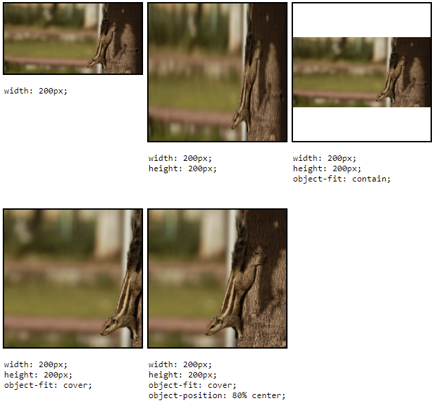

# CSS grid 2

## Opakování

- `display: grid`
- `grid-template-columns: 1fr 200px`
- `grid-template-rows: auto 10rem`
- `gap: 20px`

## Úkol na teď

Postupuj podle zadání na [github.com/…/Cviceni-CSS-grid-kalendar](https://github.com/Czechitas-podklady-WEB/Cviceni-CSS-grid-kalendar).

## Vyplnění plochy obrázkem

Vlastností `object-fit` můžeš specifikovat, jak má obrázek vyplnit omezenou plochu. Pokud obrázku nastavíš rozměry, které mají jiný poměr stran, obrázek se deformuje.

```css
img {
	width: 100px;
	height: 100px;
}
```

Nastavením `img { object‑fit: cover; }` obrázku řekneš, že se má případně oříznout, aby zabránil deformaci. Hodnotou `contain` zabráníš deformaci i ořezu, ale kolem obrázku může vzniknout prázdné místo.

Ukázku najdeš například na [MDN](https://developer.mozilla.org/en-US/docs/Web/CSS/object-fit).

S `object-fit: cover` se občas používá i doplňková vlastnost `object-position`, kterou je možné dospecifikovat, v které části obrázku je to nejduležitější, co se nemá ořezávat.



## Dobrovolný úkol

Postupuj podle zadání na [github.com/…/Cviceni-CSS-grid-galerie](https://github.com/Czechitas-podklady-WEB/Cviceni-CSS-grid-galerie).
