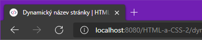

Bývá zvykem v názvu stránky zahrnout i označení aktuální podstránky. Například z `HTML a CSS 2` udělat `Dynamický název stránky | HTML a CSS 2`. Není však žádné pravidlo, jestli oddělovač má být právě `|`, `-` nebo dokonce `•`. Stejně tak nikde není stanoveno, jestli hlavní název webu vždy musí být přítomen nebo jestli nemůže být první takto `HTML a CSS 2 - Dynamický název stránky`.

### Nadpis pro všechny stránky stejný


### Nadpis s názvem podstránky



## Využití

- Rozšířený nadpis může vylepšit uživatelu orientaci ve více záložkách, v oblíbených.

- Může mít také pozitivní dopad na výsledky vyhledávání (SEO), protože vyhledávače předpokládají, že v nadpisu je důležitý text aktuální stránky, který navíc vyhledávač často použije jako náhledový text ve výsledcích.

- Společně s dalšími [metadaty](metadata) je použit při sdílení na sociálních sítích.

## Úprava šablony

Na webu s větším počtem stránek může zjednodušit údržbu úprava základního layoutu. Předpokládejme, že každá podstránka, u které chceme rozšířený nadpis má nastavenou proměnnou `nadpis`. Šablona by pak mohla vypadat takto:

### `layouty/zakladni.njk`

```liquid
<title>{{ nadpis }} | HTML a CSS 2</title>
```

Pokud má stránka `nadpis`, použije se a přidá se za něj `|`.

### `podstranka.njk`

```liquid
---
layout: zakladni
nadpis: Dynamický název stránky
---

<h2>…</h2>
<p>…</p>
```

A výsledné HTML pak bude vypadat takto:

### `podstranka/index.html`

```html
<title>Dynamický název stránky | HTML a CSS 2</title>
```
