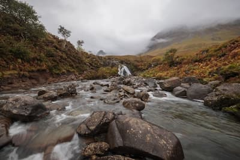
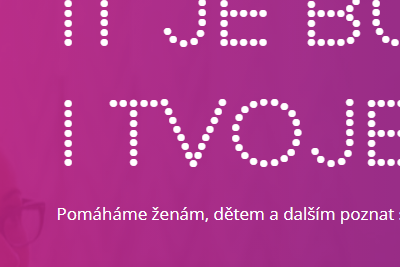
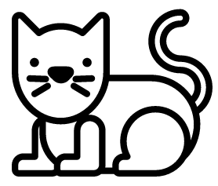
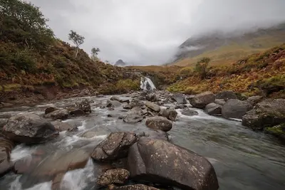

Velikost obrázkových souborů se snažíme držet co nejmenší, aby k návštěvníkům přes internet rychle doputovaly. Nepoužíváme proto zbytečně příliš kvalitní fotografie například pro malé náhledy v galerii. Pro zmenšení obrázků se může hodit online nástroj [Squoosh](https://squoosh.app/). Další možnou úsporou je volba vhodného formátu, přípony souboru. Na webu se nejčastěji setkáváme s `.jpg`, `.png`, `.svg`.

## Nejčastější formáty

### JPG

Vhodný na fotografie, kdy není kladen důraz na přesnost každého pixelu, protože používá ztrátovou kompresi. (Často s nastavením „[progresivního renderování](https://www.google.com/search?q=progressive+jpeg&tbm=isch)“, kdy se obrázek na pomalém připojení postupně zaostřuje místo načítání po řádcích od shora dolů.)

### PNG

Občas za cenu větší velikosti nabízí na pixel přesné zaznamenání obrazu. Vhodné pro snímky obrazovky. Podporuje průhlednost.

### SVG

Vektorový formát vhodný zejména pro ikonky, loga, obrázky složené z geometrických tvarů. Lze v prohlížeči zvětšovat bez ztráty kvality. Obsah souboru je v čitelné podobě připomínající HTML. Podporuje průhlednost.

## Další používané

### GIF

Krátké animace s nízkým počtem barev včetně průhledné. Vhodné pro krátké smyčky. Pro větší, delší záznamy používající více barev volíme spíše video formáty jako MP4.

### WEBP

Kombinuje výhody JPG a PNG, ale prohlížeče ho začali podporovat teprve [nedávno](https://caniuse.com/webp). Pokud by si chtěl uživatel obrázek stáhnout a otevřít v jiném programu, může narazit na problém s podporou.

### ICO

Používaný pouze pro ikonku záložky (`favicon.ico`). Postupně nahrazovaný modernějšími formáty.

## Pro pokročilé

- Postupné stahování obrázků, až když jsou potřeba, vidět na obrazovce, pomocí atributu `loading="lazy"`. Více na [MDN](https://developer.mozilla.org/en-US/docs/Web/HTML/Element/img#loading).
- Responzivní weby často vyžadují různě veliké obrázky podle velikosti zařízení. Jeden soubor/fotografie může být zbytečně moc velký na malé obrazovce nebo naopak moc malý, nekvalitní na obrazovce velké. Pomocí atributu `srcset` můžeme jednomu HTML obrázku přiřadit více souborů s odlišnými parametry. Více například na [Vzhůru dolů](https://www.vzhurudolu.cz/prirucka/srcset-sizes) nebo [MDN](https://developer.mozilla.org/en-US/docs/Learn/HTML/Multimedia_and_embedding/Responsive_images).

## Cvičení

Prohlédněte si úvodní stránku [www.czechitas.cz](https://www.czechitas.cz/) a zkuste odhadnout, jaké formáty pro různé obrázky používá. Případně navrhněte tipy na zlepšení, co se volby formátů týče.
