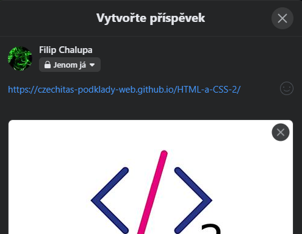

# Metadata

Do hlavičky `<head>` přidáváme mimo jiné různé doprovodné informace, které slouží pro lepší prezentaci stránky mimo viewport, který zobrazuje obsah `<body>`.

## Název

Hlavní text, který se ukazuje ve výsledcích vyhledávání, při sdílení, v záložkách.

```html
<title>Název webu</title>
```

## Favicon

Malá ikonka ukazující se vedle názvu.

```html
<link rel="shortcut icon" href="favicon.ico" type="image/x-icon" />
```

Moderní prohlížeče pro favicon podporují už i [PNG](https://caniuse.com/link-icon-png) a některé dokonce [SVG](https://caniuse.com/link-icon-svg).

## Popis

Stručné shrnutí obsahu webu. Ukazuje se při sdílení, v některých vyhledávačích.

```html
<meta name="description" content="Popis dlouhý přibližně 50 až 160 znaků." />
```

## Obrázek

Doprovodný obrázek pro sdílení. Doporučený poměr stran je `2:1`. Pro [Facebook](https://developers.facebook.com/docs/sharing/webmasters/images/) pak rozlišení `1200 x 630`.

```html
<meta
	property="og:image"
	content="https://czechitas-podklady-web.github.io/HTML-a-CSS-2/static/og-image.jpg"
/>
```

## Úkol na teď

- Přidej do projektu meta tagy pro lepší sdílení webu na sociálních sítích.

  - Pokračuj v libovolném projektu postaveném na Eleventy nasazeném na Netlify.

  - Přichystej si obrázek pro `og:image`. Použij tvůj vlastní nebo si nějaký stáhni třeba na [unsplash.com](https://unsplash.com/).

  - Ořízni ho do doporučených rozměrů. Pro ořez můžeš použít [squoosh.app](https://squoosh.app/) nebo jiný editor.

  - Do layoutu společného pro všechny stránky mezi značky `<head>` přidej odkaz na obrázek z kroků výše.

  - Přidej ještě textový popis webu, `description`. Obsah vymysli vlastní vhodný pro konkrétní projekt nebo použij následující: `Zkušební popis webu pro otestování sdílení na sociálních sítích.`

- Změny commitni, pushni a počkej, až se nasadí.

- Otestuj, že se obrázek a popis při sdílení ukazuje.

  - Můžeš například na Facebooku pro test sdílet příspěvek, který uvidíš jenom ty. Po vyzkoušení ho klidně smaž. Nebo si ve zprávách pošli odkaz sama sobě.

    

  - Občas se stává, že při prvním sdílení se obrázek hned neukáže. Pokud je to tvůj případ, ověř, že ho Facebook najde alespoň v nástroji [Sharing Debugger](https://developers.facebook.com/tools/debug/).

  - Pro znovunačtení nejaktuálnějších informací o tvém webu použij tlačítko `Scrape Again`. Hodí se v situaci, kdy obrázek při vývoji často měníš.

    
