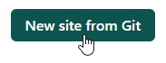
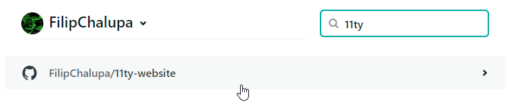

# Netlify deploy

Alternativa GitHub pages. Také se umí zdarma propojit s repozitáři na GitHubu a vystavovat je jako veřejné stránky.

Pro pokročilé funkce je nutné se registrovat na [app.netlify.com](https://app.netlify.com/) ideálně přes GitHub tlačítko, aby další provázání s GitHubem bylo co nejjednodušší.

Netlify při vystavování nové verze může pouštět `npm` příkazy a tím vytvořit například složku `dist`. To se hodí u projektů postavených pomocí Eleventy.

## Napojení prvního repozitáře

Předpokládejme, že máme na GitHubu veřejný repozitář se zdrojovými kódy webu postaveného na Eleventy. Tento web chceme zpřístupnit běžným uživatelům internetu, pro které musíme vytvořit distribuční složku a nahrát ji na nějaký hosting.

- Po přihlášení na [Netlify](https://app.netlify.com/) najdeme tlačíko pro spuštění nového webu z gitu pomocí tlačítka `New site from Git`.

  

- Dále volíme provázání s GitHubem.

  

- Výzvu o udělení přístupu, aby Netlify mohlo číst náš kód z GitHubu, schválíme.

- Vyhledáme repozitář.

  

- Nastavíme instrukce pro sestavení a pustíme první nasazení/deploy. Pro konkrétní projekt je především důležitá část `Build command`, kam dáváme příkaz pro sestavení a `Publish directory`, ve které vzniknou soubory určené pro prohlížeče.

  

- Až deploy doběhne, v horní části přehledu se nám ukáže adresa, kde web běží.

- Kdykoliv pushneme na GitHub, Netlify si automaticky převezme nový kód, sestaví ho a nasadí na stejnou adresu.

## Úprava domény

Netlify automaticky pro každý projekt vybírá náhodnou adresu končící na `.netlify.app`. Text před první tečkou je možné změnit v sekci `Domain settings` > `Options` > `Edit site name`.

Pro provázání s vlastní koupenou doménou pak slouží tlačítko `Add custom domain`.

## Úkol na teď

- Vyber si z existujících nebo nahraj nový Eleventy repozitář na tvůj GitHub účet.

- Propoj ho s Netlify.

- Odkaz na veřejnou stránku `*.netlify.app` přidej do popisku repozitáře na GitHubu.

- Něco v repozitáři uprav, commitni a pushni. Můžeš změnit třeba nějaký nadpis. Koukni do administrace Netlify a sleduj, jestli se automaticky spustil nový deployment.

- Až doběhne, zkontroluj, že se data na webu změnila.
