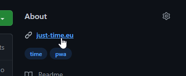

Pokud zveřejňujeme web, většinou chceme, aby byl snadno dohledatelný pro případ, že někdo například nezná adresu. Pro kontrolu, že je web pro vyhledávače dobře úzpůsobený, určitě stojí za to ho zkusit vyhledat na [Seznamu](https://www.seznam.cz/), [Googlu](https://www.google.com/).

Typicky čerstvě spuštěný web nemusí být hned dohledatelný. Aby se do vyhledávačů dostal, musí na něj odkazovat jiné veřejné weby nebo jej můžeme přidat ručně z ovladacího panelu dané služby.

Pro zveřejnění odkazu muže posloužit popisek repozitáře na GitHubu nebo zmínka na spřáteleném webu.

## Seznam

[Webmaster beta](https://reporter.seznam.cz/wm/)

## Google

[Google Search Console](https://search.google.com/search-console)

## Co když má web hodně podstránek, na které se nikde neodkazuje

Jako nápověda o struktuře webu a jak často se jednotlivé stránky aktualizují může posloužit soubor `sitemap.xml`, o kterém je napsáno více například na [jecas.cz](https://jecas.cz/sitemap).

## Jak naopak skrýt web před vyhledávači

- Nikde na něj neodkazovat. 🤔

- Tagem v hlavičce `<meta name="robots" content="noindex, nofollow">`.

- Souborem `robots.txt`. O jeho obsahu více například na [jakpsatweb.cz](https://www.jakpsatweb.cz/robots-txt.html).
