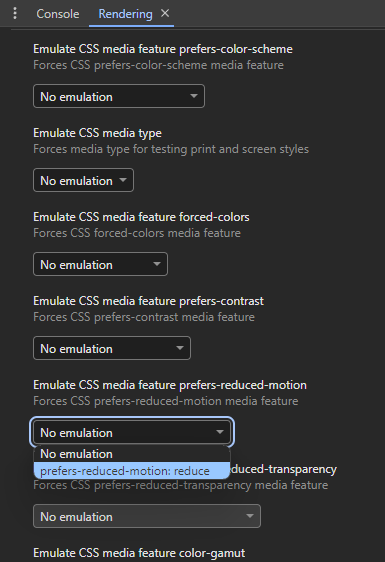

## Potlačení animací

Přechody a animace mohu být rušivé pro některé uživatele. Některým uživatelům mohou přechody způsobovat nevolnost, jiní mohou mít problémy s koncentrací. Animace také rychleji vybíjejí baterku. Pro tyto uživatele je na místě animace potlačit.

Pomocí media query můžeme rozpoznat, že uživatel má na svém zařízení nastavené snížené pohyblivé efekty a v takovém případě animace zrušit.

```css
.prvek {
	animation: blikani 1s infinite;
}
@media (prefers-reduced-motion) {
	.prvek {
		animation: none;
	}
}
```

## Vývojářské nástroje

Každý kód je dobré si vyzkoušet. Ve vývojářských nástrojích v záložce `Rendering`, česky `Vykreslování`, si můžete zkusit zapnout emulaci snížení pohybových efektů.



Pokud budete mít nastaveno `prefers-reduced-motion: reduce`, klokan níže by se neměl pohybovat.

<style>
	@keyframes klokan {
		0%, 100% {
			transform: translateX(0);
		}
		25%, 75% {
			transform: translateX(1em);
		}
		50% {
			transform: translateX(2em);
		}
	}
	@keyframes klokan__in {
		0%, 100% {
			transform: translateY(0);
		}
		30% {
			transform: translateY(-50%);
		}
	}
	.klokan {
		font-size: 2em;
		animation: klokan 4s infinite;
	}
	.klokan__in {
		animation: klokan__in 1s infinite;
	}
	@media (prefers-reduced-motion) {
		.klokan,
		.klokan__in {
			animation: none;
		}
	}
</style>
<div class="klokan">
	<div class="klokan__in">🦘</div>
</div>

## Tmavé téma

Tmavé téma je oblíbené mezi uživateli, kteří tráví hodně času u počítače. Tmavé téma šetří oči a u některých typů displaye i baterku. Tmavé téma je také vhodné pro některé uživatele se zrakovým postižením.

Prohlížeče předpokládají, že weby píšeme ve světlém stylu. Proto nejdříve v HTML hlavičce řekneme, že náš web podporuje téma světlé i tmavé.

```html
<head>
	<meta name="color-scheme" content="light dark" />
	<!-- … -->
</head>
```

V CSS pak, pokud chceme třeba pro tmavé téma použít jiné barvy, můžeme použít media query.

```css
@media (prefers-color-scheme: dark) {
	body {
		background-color: black;
		color: white;
	}
}
```
