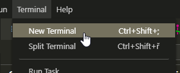
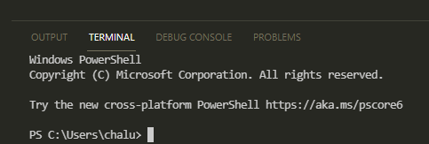
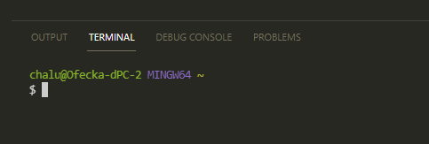
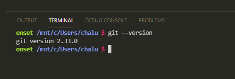
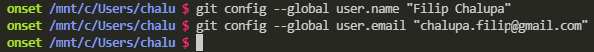
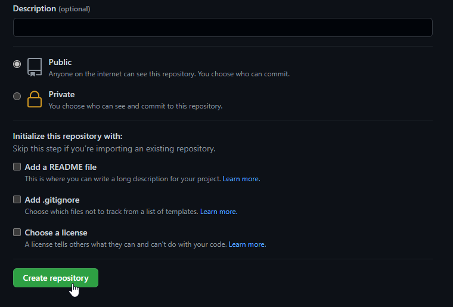
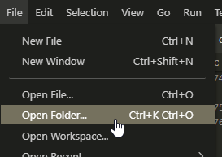

# Práce s gitem

Git je nástroj na správu kódu. Užitečný zejména pro zálohu kódu, sdílení s dalšími účastníky, napojení na další služby jako je například webový hosting.

## Git vs GitHub

- Git si instaluješ k sobě na počítač.
- [GitHub](https://github.com/), [GitLab](https://about.gitlab.com/), [Bitbucket](https://bitbucket.org/) jsou služby, které si dobře rozumí s gitem. Umí si od něj nechat nahrát kód a tím ho zazálohovat v internetu.

## Ověření instalace

- Ve Visual Studio Code otevři nový terminál / příkazovou řádku přes horní lištu `Terminal` > `New Terminal`.

  

- U spodní hrany ti vyjede záložka Terminal. Může vypadat například takto:

  

  

  

  

- Klikni do ní myší a napiš `git --version`. Stiskni klávesu `Enter`. Pokud uděláš překlep, použij šipky a klávesu `Backspace` nebo `Delete`. Na klikání myší do určité části textu se moc nespoléhej. Terminál je z doby, kdy myši ještě nebyly vynalezené. Ovládá se tak jen z klávesnice.

- Pokud máš git nainstalovaný, na následujícím řádku by se ti mělo vypsat něco jako `git version 2.33.0` nebo třeba `git version 2.20.1.windows.1`. Výpis se liší například podle tvého systému (Windows, Mac, Linux) a verze.

  

- Pokud ve výpisu vidíš `Command 'git' not found, did you mean …`, `'git' is not recognized as an internal or external command, operable program or batch file.` nebo podobnou hlášku, je možné, že máš v příkaze `git ‑‑version` překlep nebo nemáš git nainstalovaný. Zkus příkaz znovu napsat a spustit klávesou `Enter`. Nic víc nepiš. Znak `$` nebo `>` bývá v příkazové řádce předchystaný a my ho tedy při zadávání příkazů neopisujeme.

  

## První krůčky s gitem

- Pomocí gitu budeš na projektech zaznamenávat jednotlivé kroky, úpravy kódu, html, css, ale i obrázků. Vznikne tím historie, díky které si později budeš moct připomenout, proč jsi co v kódu měnila a případně se budeš moct ke starší verzi i vrátit, když třeba zjistíš, že původní varianta byla lepší nebo se ti aktuální rozbila a nedaří se ti ji opravit.

- Každý krok, balíček změn, které typicky řeší jednu menší komponentu, stylování tlačítka, přidání navigace na spránce apod. se v názvosloví gitu jmenuje `commit`. Každý commit má svého autora, a proto musíš gitu říct, jak se jmenuješ a jaká je tvá e-mailová adresa. Pro oba údaje je ideální vyplnit stejné údaje jako na [GitHubu](https://github.com/).

- Jméno nastav příkazem `git config --global user.name "Jméno Příjmení"` a stiskni `Enter`.

- E-mail nastav příkazem `git config --global user.email "muj@email.cz"` a stiskni `Enter`.

  

- Většinou se také hodí gitu říct, že jako hlavní nástroj pro psaní kódu používáš Visual Studio Code. To uděláš příkazem `git config --global core.editor "code --wait"`.

- Toto nastavení je pro všechny projekty společné a stačí ho po čerstvé instalaci gitu provést pouze jednou.

- Pokud si chceš zkontrolovat, že máš hodnoty správně nastavené, pusť příkazy bez hodnoty v uvozovkách.

  

## Vytvoření repozitáře z nuly

Žádný počítač nevydrží věčně. Radši se připrav na nejhorší. Pro případ, že by se tvé zařízení jednou prostě neprobralo, radši všechnu práci zálohuj. Jedna z nejpopulárnějších služeb pro uchování kódu online je [GitHub](https://github.com/). Mimo jiné díky tomu, že nabízí spoustu funkcí zdarma.

- V gitu a na GitHubu je praktické rozdělovat weby zvlášť na jednotlivé repozitáře. Každá takový repozitář má svůj vlastní název, historii změn a další nastavení. Nový repozitář vytvořím ikonkou ➕ v pravém horním rohu zvolením `New repository`.

  

- Každý repozitář musí mít vyplněné jméno.

  

- Ve zbylém nastavení je vhodné zvolit `Public`, což umožní zapnout GitHub pages, které si ukážeme později. Ostatní zaškrtávátka můžou zůstat prázdná.

  

- Podle následujícího postupu si vytvoř složku s repozitářem u sebe na počítači, ve které budeš vytvářet html a css kód, případně přikládat obrázky a jiné typy souborů.

  - Otevři ve Visual Studio Code složku, kam běžně dáváš většinu webových projektů.

  - Otevři terminál a zadej do něj `git clone https://github.com/FilipChalupa/muj-prvni-web.git`. Adresu nahraď tvou vlastní.

    

    

  - Otevři ve Visual Studio Code jen nově vytvořenou složku.

    

## Práce na projektu

Pomocí `git clone …` sis vytvořila složku, která je provázaná s GitHub repozitářem. V dalších krocích následuje postup, jak postupně přidávat a zálohovat obsah.

1. Přidej/uprav nějaký soubor nebo několik spolu souvisejících souborů.
1. V příkazové řádce označ soubory, že jsou nachystané pro zálohu pomocí `git add .`
1. Balíček změn pojmenuj přes `git commit -m "Stručný popis změn na pár slov"`.
1. Commit nahraj na GitHub zadáním `git push`.
1. Zkontroluj, že změny se ukazují na GitHubu a pokračuj od bodu 1.

## GitHub pages

Kromě podpory gitu GitHub nabízí doplňkovou službu GitHub pages, díky které je možné si nechat zdarma hostovat stránky.

## Úkol na teď

Postupuj podle [zadání zde](git-cviceni.md).

## Bonus

- Nainstaluj a prozkoumej [Git Graph](https://marketplace.visualstudio.com/items?itemName=mhutchie.git-graph).

  - Zobraz si historii změn.

  - Proklikej pár commitů.

  - Koukni, jak vypadá `diff`. Rozklikni v commitu soubor. Červenou uvidíš smazané řádky a zelenou nově přidané.

- Nainstaluj a prozkoumej [GitLens](https://marketplace.visualstudio.com/items?itemName=eamodio.gitlens).

  - U jednotlivých řádků by se ti nově mělo ukazovat šedým nevýrazným textem, kdo je kdy upravil.

- [Git and GitHub - The Complete Guides](https://dev.to/ifierygod/git-and-github-the-complete-guides-chapter-1-23cp)

## Fork

Občas se hodí navázat na práci, kterou začal někdo jiný. Tlačítkem `Fork` u cizího repozitáře vytvoříš tvou vlastní kopii, kterou můžeš dále upravovat, aniž bys zasáhla do původního kódu patřícího někomu jinému. Tuto fukci můžeš využít například pro řešení budoucích cvičení během lekcí zadaných v samostatných repozitářích.

1. Tlačítkem `Fork` vytvoříš kopii.

   

1. V nově vzniklém repozitář zůstane poznámka s odkazem na originál.

   

1. Pod rozkliknutým zeleným tlačítkem `Code` najdeš adresu pro klonování.

   
