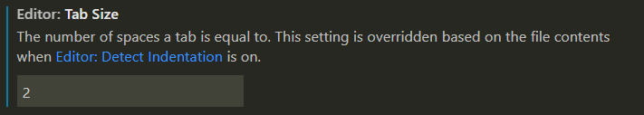
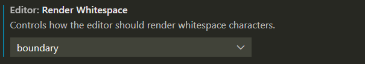
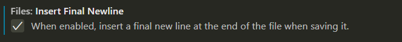

- [Ukázkové řešení](https://github.com/Czechitas-podklady-WEB/Cviceni-Eleventy-filmy/tree/reseni)

- Hvězdičky

  - Opakující se `background-image`
  - BEM modifikátor `hodnoceni--skore-2`

- Jak dostat njk soubory do samostatné podsložky

  - Eleventy vyčlenění šablon do samostatné podsložky nepodporuje. 🙁

- Dělení stylových souborů

  - Jednotlivé BEM bloky je vhodné dávat do samostatných souborů. Je matoucí, když se například v souboru `paticka.scss` kromě patičky `.paticka {}` styluje i `.hlavicka {}`.

- Taby a mezery

  - Pro odsazení textu je dobré se držet jen jedné varianty. Při mixu se kód jinak rozsype na různě nastavených systémech. Některé pro taby používají ekvivalentní šířku dvou, čtyř nebo dokonce osmi mezer.

  - Šířka tabu lze ve VS Code nastavení změnit přes `Editor: Tab Size`.

    

  - Vizualizace neviditelných znaků lze zapnout přes `Editor: Render Whitespace`.

    

- Je zvykem textové soubory (HTML, CSS, NJK, SASS, …) ukončovat prázdným řádkem na konci. Zejména nástroje pro příkazovou řádku s tím počítají. Automatické vkládání posledního řádku lze zapnout přes `Files: Insert Final Newline`.

  
